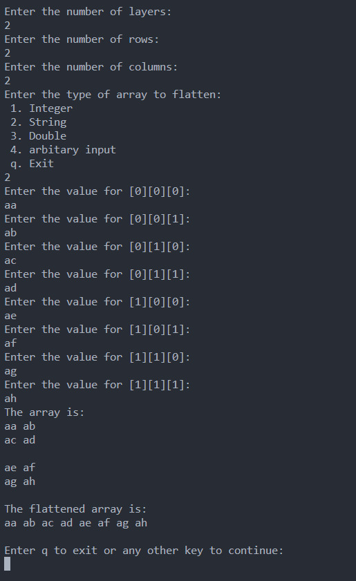

## Description

A 3D-1D Matrix Flatten written in c++.
The program runs an arbitary example at the beginning then ask user for dimensions of input matrix and data.

## Run Program

```
g++ flatten.cpp
./a.exe
```

## Screenshots


