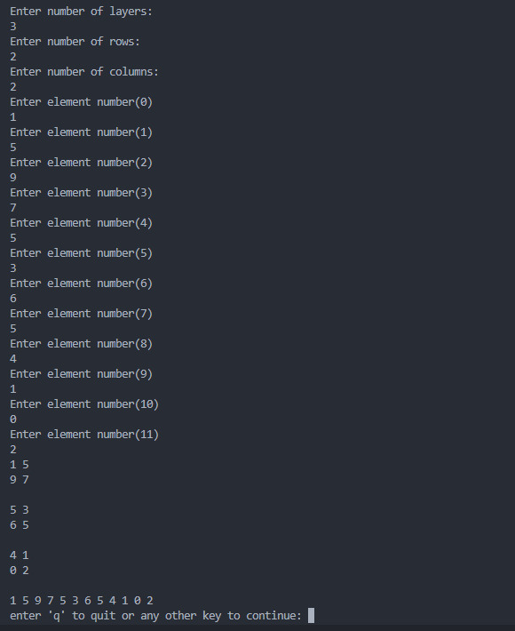

## Description

A 3D-1D (Integer - String - Double - Arbitary Input) Matrix Flatten written in java.
The program runs an arbitary example at the beginning then ask user for dimensions of matrix , type and then data.

## Run Program

```
java flatten.java
```

## Screenshots


